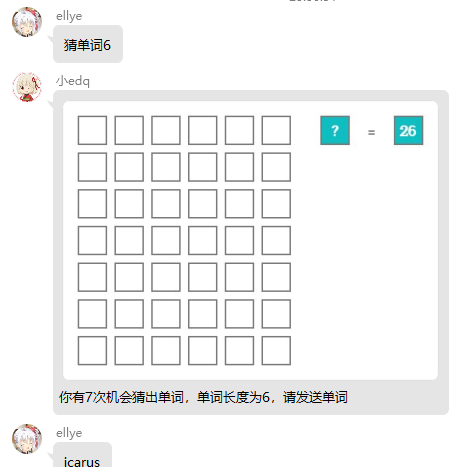
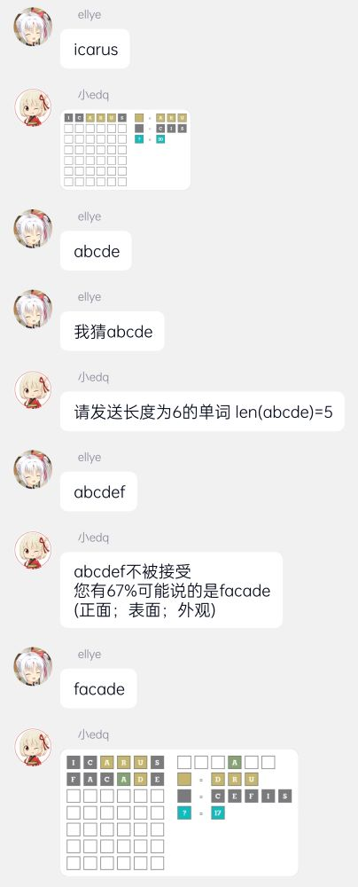
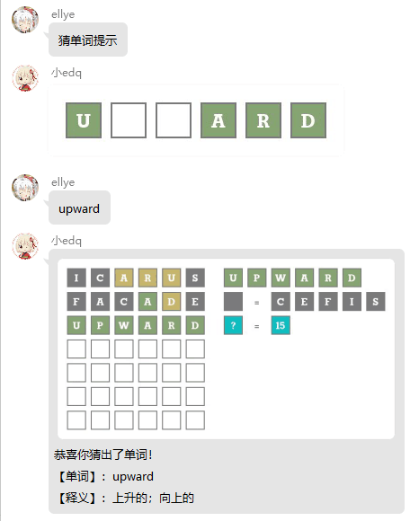

# Wordle4Hoshino
从[nonebot-plugin-wordle](https://github.com/noneplugin/nonebot-plugin-wordle)移植

基于hoshinobot的猜单词插件

与原版相比，增加了大量辅助性提示以降低游玩门槛，提高可玩性

## 依赖

```pip install pyenchant```

centos等系统：```dnf install python3-enchant```

（好像还要装一个其它什么的，反正报什么错就装什么）

## 玩法
```
指令列表（发送时不含尖括号）：

开始游戏指令：猜单词<字母数(默认为5)> <来源词库(默认为CET4)>
支持的词典：CET4 CET6 GMAT GRE IELTS SAT TOEFL 专八 专四 考研

猜单词指令：我猜<单词>
或直接发送<单词>，但仅响应字母位数正确的单词

提示指令：猜单词提示
终止游戏指令：猜单词结束

绿色块代表此单词中有此字母且位置正确；
黄色块代表此单词中有此字母，但该字母所处位置不对；
灰色块代表此单词中没有此字母；
特别的，若猜测单词中出现x个相同的字母，但只有y个颜色为灰色时，表示原单词中存在x-y个该字母。

提示中的灰色块表示肯定不会在原单词中出现的字母；
提示中的蓝色块表示在所有猜测单词中从未出现的字母。
```

## 截图






